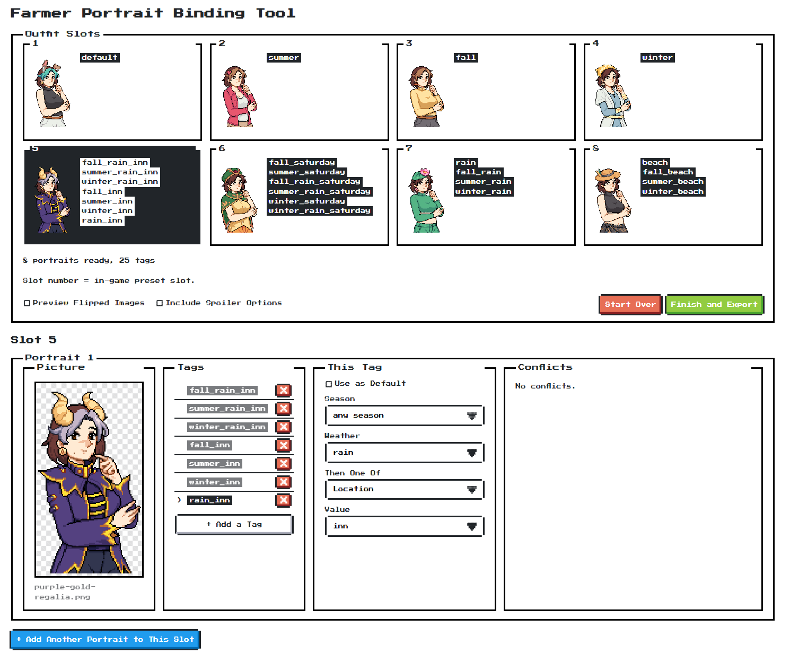

# Farmer Portraits Synchronized


Custom dialogue portraits for Fields of Mistria that also change your farmer's
outfit to match.

It is a companion to **Farmer Portraits** by DeUlo, which already swaps the
portrait. This adds two things: a browser tool that builds the mod folder for
you from your PNGs, and a small mod that keeps the mini-sprite's clothes in step
with whichever portrait is on screen.

> **Alpha.** Verified in game on Windows, by one person, on one install. Back up
> your save and expect rough edges.

**[Download the latest release](../../releases/latest)**: one zip, no build step.
Unzip it and read `README.txt`; it covers the install start to finish.

## What's in here

| | |
|---|---|
| `portrait_tool.html` | the builder. Open it in a browser. No install, no server, no network |
| `FarmerPortraitsSync/` | the outfit mod. Goes in your mods folder once |
| `README.txt` | the instructions that ship with a release |

## You need

- [MOMI](https://www.nexusmods.com/fieldsofmistria/mods/78), the mod installer
- [Farmer Portraits](https://www.nexusmods.com/fieldsofmistria/mods/703) by DeUlo
- Portraits as PNG with a transparent background. This was built around
  [this Picrew](https://picrew.me/en/image_maker/2750165/) by **not_darkly**,
  whose exports work as they come: the tool downsamples, mirrors and pads them
  for you

**Art from somewhere else works too.** Any PNG of any size is accepted: anything
taller than the portrait frame is scaled down to fit, keeping its aspect ratio,
and the tool says what it resized. Nothing is ever cropped, so if your character
sits in a lot of empty space, trim it in an image editor first or they will
render small.

## Install

Everything lives in the game's own mods folder, the one MOMI reads:

```
...\steamapps\common\Fields of Mistria\mods\
```

**1. Once, ever.** Put `FarmerPortraitsSync` in there, beside the
`Farmer Portraits` folder that is already there.

**2. Build your portraits.** Open `portrait_tool.html`. Drag your PNGs onto the
slots, give each one a tag, tick **Use as Default** on exactly one, then
**Finish and Export**.

**3. Install them.** Unzip the download and put the folder inside into the same
mods folder.

> **If `FarmerPortraitsExample` is already there, delete it first.** Merging
> leaves old portraits behind, and they can outrank your new ones with no error
> anywhere.

**4. Open MOMI, tick both mods, hit Install.** Artwork is baked in at install
time, so this is needed after every export.

**5. In game, build your outfit presets** so preset 1 matches slot 1, preset 2
matches slot 2, and so on.

To change your portraits later, repeat steps 2 to 4. The tool remembers your
work between visits, and the outfit mod from step 1 never needs touching again.

## How it works



**8 slots, one per in-game outfit preset.** Grid position is the preset number,
so the portrait in slot 3 is worn with preset 3.

**Several portraits can share a slot**, each with its own trigger, when one
outfit should cover all of them:

```
   slot 3     winter_rain     \
              winter_sunny     >  all wear outfit preset 3
              winter_thunder  /
```

**One portrait can answer to several tags.** The mod resolves a tag to a sprite
file, so the same art in summer and at the beach really is two files. But you
upload it once and add a second tag to the same picture, rather than keeping two
copies of the same PNG in sync by hand.

**A tag is a season, a weather and one more condition:** location, weekday,
day of month, indoor or outdoor, or a cutscene. Only the combinations the mod
actually looks up are offered, checked against the mod's own code rather than
its readme, because a tag off that list fails silently in game.

**Spoiler names are off by default.** Cutscene names, and the late-game or
secret locations, sit behind a checkbox. The names alone give away story beats,
which is how DeUlo publishes them too.

**Unreachable portraits are caught before export.** The mod takes the first
matching tag in its precedence order, so covering winter indoors and winter
outdoors leaves a plain `winter` portrait with nothing to appear in. The tool
works that out, says which tags buried it, and refuses to export until it is
fixed.

**Every portrait carries a Conflicts panel.** The quieter problem is a tag that
still works but has quietly lost a slice: `summer` outranks `beach`, so a beach
portrait is simply gone all summer with no error anywhere. The panel lists the
tags that win before this one and what each costs, with a button that adds the
one tag which wins those contexts back. When no tag can (there is no
`saturday_beach`), it says so instead of offering a button that would not work.

**Export gives you one zip holding one correctly named mod folder.** The
tag-to-slot table is generated inside that folder, so the clothes and the
artwork install together and cannot fall out of step.

## Credits

The builder wears [**NES.css**](https://nostalgic-css.github.io/NES.css/) by
B.C.Rikko, an 8-bit style framework (MIT), set in
[**Press Start 2P**](https://fonts.google.com/specimen/Press+Start+2P) by
CodeMan38 (SIL Open Font License). Both load from a CDN rather than being
bundled, so the tool stays one file; offline it still works and exports
correctly, it just looks plain.

**Farmer Portraits** is DeUlo's work and **MOMI** is the community mod
installer. Neither is included here. Portrait art in the screenshots comes from
[not_darkly's Picrew](https://picrew.me/en/image_maker/2750165/); whatever you
build with it stays yours to check against that maker's own terms.

Not affiliated with DeUlo, with not_darkly, or with NPC Studio.

MIT licensed, see `LICENSE`.
